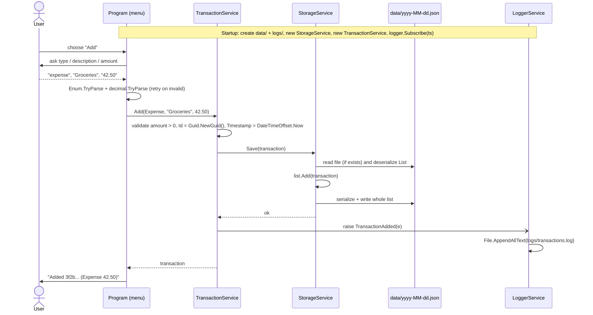
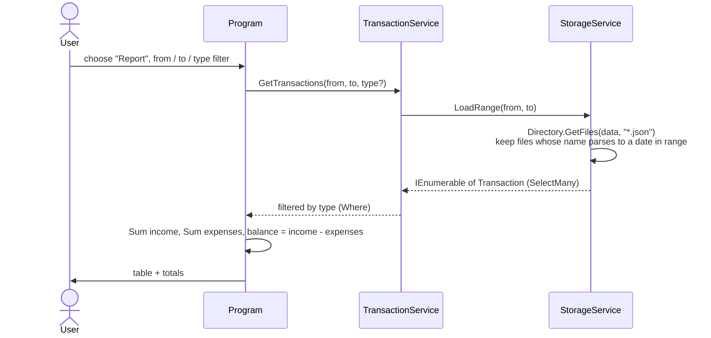

# CashStack – UML

Design target for the MVP. Signatures are a guide — adjust names while implementing, then update this file so README and code stay in sync.

## Class diagram

```mermaid
classDiagram
    direction LR

    namespace Models {
        class TransactionType {
            <<enumeration>>
            Income
            Expense
        }
        class Transaction {
            +Guid Id
            +DateTimeOffset Timestamp
            +TransactionType Type
            +string Description
            +decimal Amount
        }
    }

    namespace Events {
        class EventArgs {
            <<.NET>>
        }
        class TransactionAddedEventArgs {
            +Transaction Transaction
        }
    }

    namespace Services {
        class StorageService {
            -string _dataDirectory
            -JsonSerializerOptions _jsonOptions
            +StorageService(string dataDirectory)
            +Save(Transaction transaction) void
            +LoadRange(DateOnly from, DateOnly to) IEnumerable~Transaction~
            +Remove(Guid id) bool
            -GetFilePath(DateOnly day) string
            -ReadFile(string path) List~Transaction~
            -WriteFile(string path, List~Transaction~ transactions) void
        }
        class TransactionService {
            -StorageService _storage
            +event EventHandler~TransactionAddedEventArgs~ TransactionAdded
            +TransactionService(StorageService storage)
            +Add(TransactionType type, string description, decimal amount) Transaction
            +Remove(Guid id) bool
            +GetTransactions(DateOnly from, DateOnly to, TransactionType? type) IEnumerable~Transaction~
            #OnTransactionAdded(Transaction transaction) void
        }
        class LoggerService {
            -string _logFilePath
            +LoggerService(string logFilePath)
            +Subscribe(TransactionService service) void
            -OnTransactionAdded(object? sender, TransactionAddedEventArgs e) void
        }
    }

    class Program {
        <<top-level statements>>
        menu loop
        input helpers
        report output
    }

    Transaction --> TransactionType : has
    TransactionAddedEventArgs --|> EventArgs : inherits
    TransactionAddedEventArgs --> Transaction : carries
    TransactionService --> StorageService : uses (constructor injection)
    TransactionService ..> TransactionAddedEventArgs : raises
    LoggerService ..> TransactionService : subscribes to TransactionAdded
    StorageService ..> Transaction : reads / writes JSON
    Program --> TransactionService : calls
    Program ..> LoggerService : creates + wires
    Program ..> StorageService : creates
```

**Reading the arrows:** `-->` = holds a reference / uses · `--|>` = inheritance · `..>` = depends on (creates, raises, subscribes) · `+` public · `-` private · `#` protected.

**Key rule (from the hints):** only `StorageService` touches files in `data/`. `TransactionService` has no `File.*` calls — that's what makes it testable with a fake storage later (stretch goal → `IStorageService`).

## Sequence: adding a transaction (FR003, FR004, FR008, FR016)

## Sequence: report (FR006)

